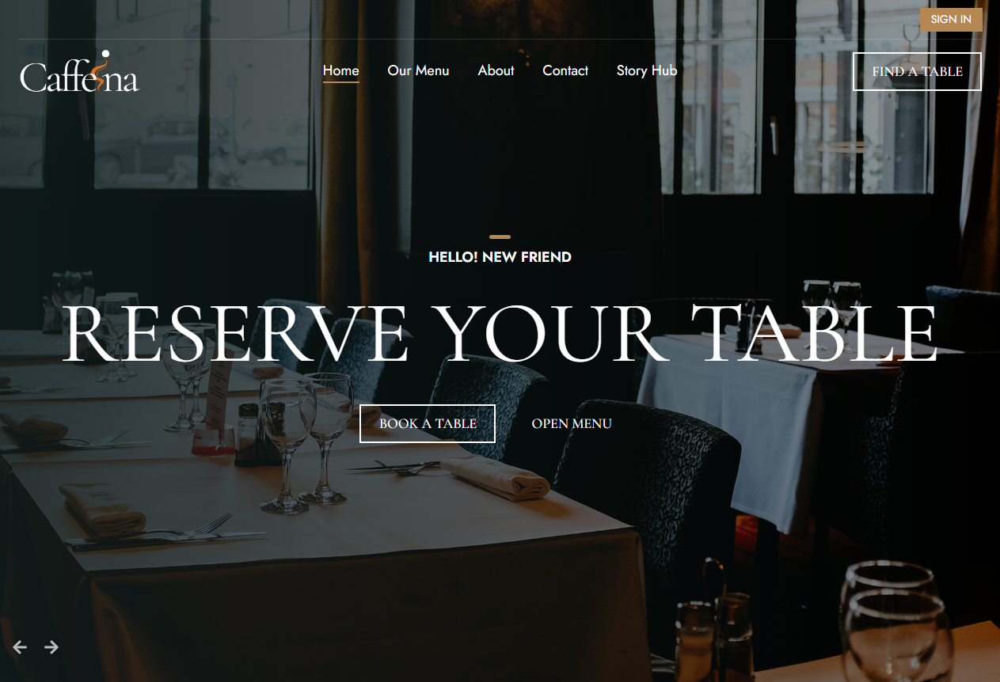

# Caffeina Haven - A Restaurant Management Website ☕

### Server Side Repo - [Server Side Repository](https://github.com/nahidul-fahim/caffeina-haven-server)
### Live site - [Website's live link](https://caffeina-haven.web.app)

## Admin login
email: admin@admin.com
password: Asdf$$

# Technologies used:
 1. HTML
 2. CSS
 3. Tailwind CSS
 4. Daisy UI
 5. JavaScript
 6. React.js
 7. React router
 8. Tanstack query
 9. Axios
 10. Tanstack table
 11. Firebase (For authentication + hosting)
 12. JWT (JSON Web Token)
 13. Payment Integration using Stripe
 14. Framer motion for animation

 # About the project

## Overview:
A user can see all the menus available, can order food online, apply valid token for discount, make payment using stripe, a community page where all users can post their stories and memories, interact with other users' stories and can reserve a table.
 **The website has:**
 * Homepage
 * Menu page
 * About page
 * Contact page
 * Community page
 * Reservation page
 * Cart page
 * Checkout page
 * Admin dashboard
 * 404 page 